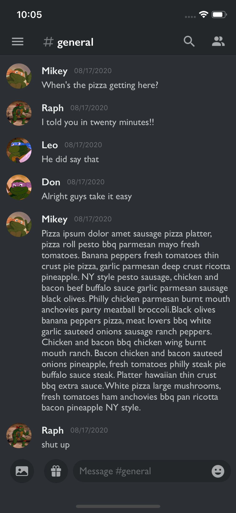
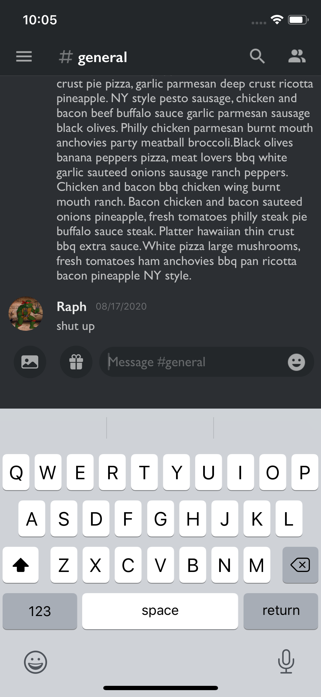

# Discord UI
## Re-creating the UI of the Discord iOS App

* UIKit 
* Programmatic UI

The purpose of this app is to practice using a Programmatic UI instead of Storyboards by recreating the Discord app's user interface. 

I wrote an article highlighting the process of this app in depth and can be found here: [Medium](https://medium.com/@leonardoidiaz/programmatic-ui-discord-de1e59b3c2be) 

---
Open Source Icons provided by 
[Material Design](https://material.io/resources/icons/?style=baseline)
[SF Symbols](https://developer.apple.com/sf-symbols/)  

